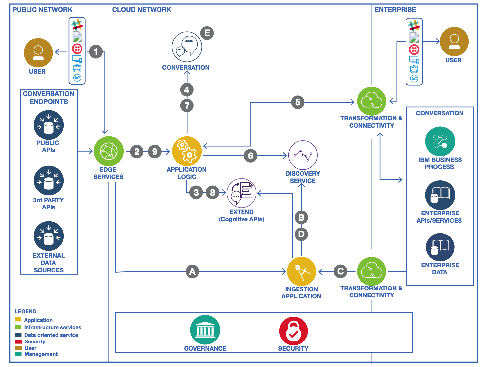
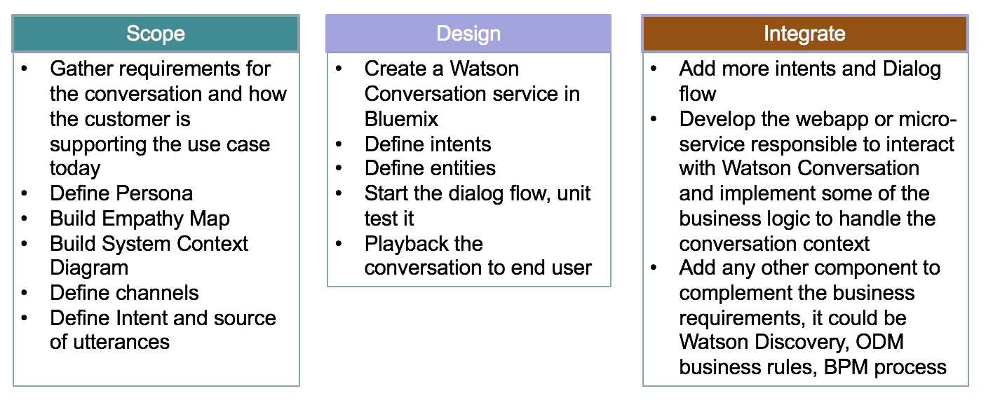
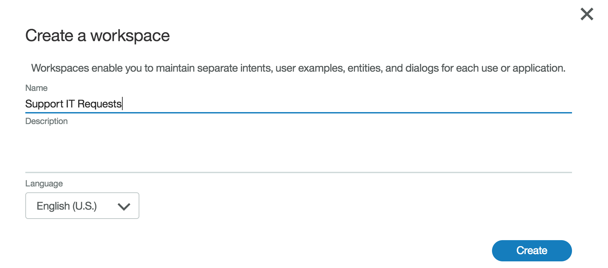
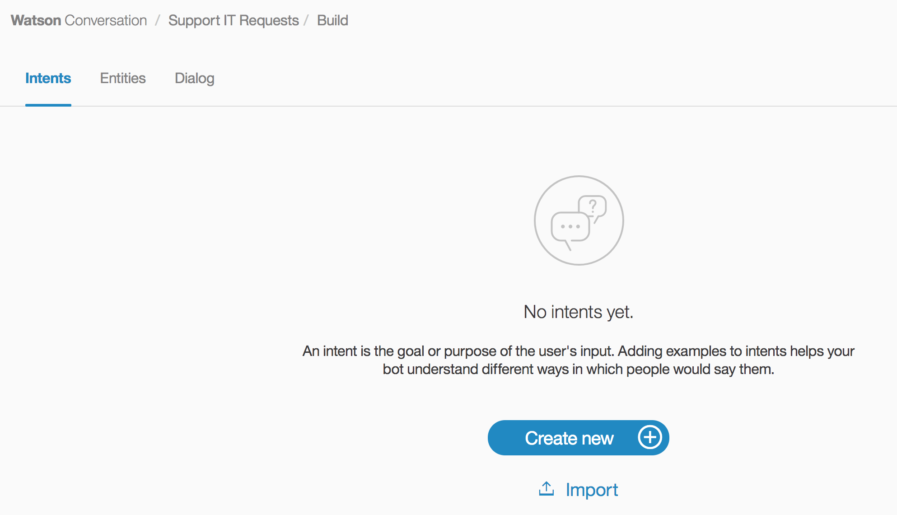
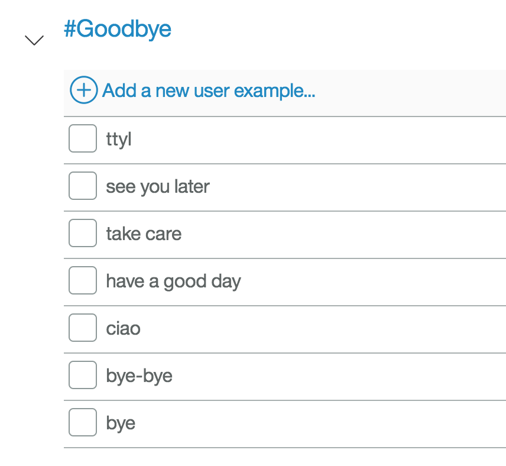

# Watson Conversation Hands-on Tutorial

Implement a simple IT support help-me conversation chatbot. The chatbot helps to streamline IT support queries by automating the dialog flow.

## Business use case
The support director wants to modernize the way to support internal staff and offload his team from basic work. Currently 20000 tickets are issued in a year. 50% of the calls are answered in 7 minutes whereas there are many situations that reach up to 70 minutes for resolution. 92% of the calls are resolved by level 1 support. Employees of the Case Inc engage with customer support mostly through phones. Today, call center agents struggle to find some of the answers in a timely fashion as the systems are not integrated. This results in loss of productivity and frustration on the part of the bank employees. Level 1 support team get frustrated at times because of unavailability of the right information and proper guidance. The Level 1 support has to consult the Level 2 support team members to get some answers.   

As presented in the [Watson Conversation reference architecture diagram](https://www.ibm.com/devops/method/content/architecture/cognitiveArchitecture) this tutorial addresses the Ground Truth development with the conversation flow design (E) and the run time processing (4,7), integrated with chatbot interface (1), and controlled by the application logic - or **broker** micro service.
  

## Table of content
This tutorial was ported to the IBM Garage method tutorial at https://www.ibm.com/devops/method/tutorials/watson_conversation_support
At the end of this training you will be able to learn the following:  
* [What is Watson Conversation (Quick Summary)](https://www.ibm.com/devops/method/content/architecture/cognitiveConversationDomain)
* [Understand the Development Steps](https://github.com/ibm-cloud-architecture/refarch-cognitive-conversation-broker/blob/master/doc/tutorial/README.md#development-steps)
* [How to apply Design Thinking for cognitive solution](https://github.com/ibm-cloud-architecture/refarch-cognitive-conversation-broker/blob/master/doc/tutorial.md#design-thinking)
* [Create Watson conversation service](https://github.com/ibm-cloud-architecture/refarch-cognitive-conversation-broker/blob/master/doc/tutorial/README.md#task-1---create-conversation-service) and workspace
* [Defining intent and entities to help natural language processing](https://github.com/ibm-cloud-architecture/refarch-cognitive-conversation-broker/blob/master/doc/tutorial/README.md#task-3---creating-intents)
* [Building simple dialog flow](https://github.com/ibm-cloud-architecture/refarch-cognitive-conversation-broker/blob/master/doc/tutorial/README.md#task-6---building-the-dialog)
* [Using the context object for more advanced dialog](https://github.com/ibm-cloud-architecture/refarch-cognitive-conversation-broker/blob/master/doc/tutorial/README.md#task-7---advanced-dialog-work)
* [Develop hierarchical flow ](https://github.com/ibm-cloud-architecture/refarch-cognitive-conversation-broker/blob/master/doc/tutorial/README.md#a-hierarchical-dialog-flow)
* [Use variable to get data from conversation](https://github.com/ibm-cloud-architecture/refarch-cognitive-conversation-broker/blob/master/doc/tutorial/README.md#using-interaction-to-get-parameters-to-call-a-web-service)
* [Using the api](https://github.com/ibm-cloud-architecture/refarch-cognitive-conversation-broker/blob/master/doc/tutorial/README.md#task-8---using-api)


# Watson Conversation Quick Summary
To have a quick understanding of Watson Conversation, you may want to read the [product overview](https://www.ibm.com/watson/developercloud/doc/conversation/index.html) section.


As a summary, you use the Watson Conversation service to create  **chatbot**. This is the generic term for a piece of software that provides automated responses to user input. The bot is hosted in the cloud and is highly available. All the information that defines your bot's behavior is contained in a **workspace**.  

You create an **application** that enables your users to interact with the bot. The application passes user's input to the bot, possibly with some additional context information, and presents responses from the bot to the user.  

The bot is **stateless**, that is, it does not retain information from one interchange to the next. The application is responsible for maintaining any continuing information. However, the application can pass information to the bot, and the bot can update the **context** information and pass it back to the application.  

The bot uses natural language understanding and machine learning to extract meaning from the user's input. This process identifies the user's **intent**, which is the goal or purpose of the asked question. It can also identify an **entity**, which is a term, a noun that is mentioned in the input and narrow the purpose of the request. You train your bot to recognize intents and entities in the input submitted by users. To train your bot on intents, you supply lots of examples of user's input and indicate which intents they map to.

To train your bot on entities, you list the values for each entity and synonyms that users might enter.
Note: the names of intents and entities, and the text of examples, values, and synonyms, can be exposed in URLs when an application interacts with your bot. Do not store sensitive or personal information in these artifacts.
As you add information, the bot trains itself; you do not have to take any action to initiate the training.

Finally, after you train your system to recognize intents and entities, you teach it how to respond when it recognizes those intents and entities. You use the **dialog** builder to create conversations with users, providing responses based on the intents and entities that the bot recognizes in their inputs.  A dialog is composed of multiple flows and subFlows to design the multiple interactions of the conversation. Intent is supported by a dialog flow.

## Development Steps
The following tasks have to be done for a project involving Watson Conversation:
* Gather requirements for the conversation and how the customer is supporting the use case today. (they may have script, coded procedure, ….)
* Define Persona and Empathy map
* Build System Context Diagram
*	Extract the potential list of intents and assess sentences that lead to those intents
*	Create a Watson Conversation service in bluemix
*	Define the intent with the conversation builder tool
*	Define entities
*	Start the dialog flow, unit test it
*	Develop the webapp or microservice responsible to interact with Watson Conversation and implement some of the business logic to handle the conversation context
*	Add any other component to complement the business requirements, it could be Retrieve and Rank, ODM business rules, BPM process…



# Applying Design Thinking
When implementing a cognitive solution, we may want to apply the [design thinking approach](../designthinking/dt.md) to develop innovative business impact application.

# Hands on lab - Step by step
So now let start doing your own *IT Support* conversation!. We organized the training into layer so beginners can focus on developing Watson Conversation artifacts and test within Watson Conversation Tool, while developers may study and tune the Broker code to support more advance features.
For beginners, please perform the tasks 1 to 6. Developers can do all the tasks.

## Pre-requisites
To design the Conversation you need
* to have a Bluemix account
* clone / download the github repository: https://github.com/ibm-cloud-architecture/refarch-cognitive-conversation-broker as you may need to use some of the file to expedite your work.

To develop on top of the Broker code, or being able to run locally or on Bluemix you need
* Knowledge of nodejs, expressjs
* Some knowledge of Angular 2

## Task 1 - Create Conversation Service
 Using your bluemix account, add a Watson Conversation Service. Select Catalog > Services > Watson > Conversation
  

In the service name enter *ITSupportConversation*, and click **Create** button on the lower right corner. You should see the following page:


Once created you can launch the **Conversation Tool** to develop the conversation artifacts: Click on the "Launch tool" icon to take you to the WCS workspace. This will open another browser window, with a prompt to login and then you should be on the Watson Conversation Workspace page.


The *Car Dashboard -Sample* is a predefined conversation used to give you some implementation examples.

## Task 2 - Creating a workspace
The workspaces enable you to maintain separate intents, user examples, entities, and dialog flows for each application. The conversation service uses a step by step, wizard like, approach to guide the developer to create workspace, intents, etc..  
Within the Workspaces panel, click on the "Create a new workspace" tile.   


Once the workspace created, we need to add **intents** using the Tool. An Intent is a group of examples of things that a user might say to communicate a specific goal or idea. To identify intents, you begin with something your user might want, and then come up with various ways the user might describe it. Then for each intent, you need to think of the various ways a user might express his/her desire, that will be the examples. Examples can be developed using a crowd sourcing approach.

From the discussion with the Support team, the Conversation developer arrives with a set of standard questions they received from their end users:
* What is the status of the business application? I could not access it
* How to get access to a business application?
* How to reset my password for a specific application?
* When to renew my workstation?
* How to bring my own device and connect it to enterprise network?

Today each of those questions are documented as FAQ inside the Support team document repository. Even some solutions are persisted in a relational database in the form of application -> problem -> solution.

## Task 3 - Creating intents

In the context of this tutorial we can extract the following intents
* Access to a business applications like expense report, AbC.  
* Reset password
* Access to supplier on boarding business process
* Bring your own device

So let add those intents in the workspace: from the *Build* page, select the Intents link and then Create new button.

  

Enter the intent name `applicationAccess` after the **#**
 character.

  

Then for each intent you need to add the examples to train the conversation for intent recognition. You can enter the same examples as above figure.

Do the same for the **goodbye** intent.  



As there are a lot of intents that can be reused from conversation to  conversation implementations, it is possible to define **csv** files anf import them in the Conversation Tool Intents. The csv format is presented in following example, one intent per line  


Using **Import** link in the Intents page, import the **wcs-workspace/ITSupport-Intents.csv** file to get the IT support demonstration intents.

## Task 4 - Intent Unit testing
As soon as you have created one intent you can test it, using the **‘Ask Watson’** button on the top right corner of the conversation editor.


Enter one of the example, you should get the ``#greetings` intent identified by Watson. You can even try new sentence and you may have Watson inferring the good intent.  

  

So it works. You can test some other intents from the imported ones.

## Task 5 - Adding entities  

An entity is a portion of the user's input that you can use to provide a different response to a particular intent.
Click on the "Entities" link at the top of the page.  Then the **Create new** button.


Adding values and synonyms to entity helps your chatbot learns and understands important details that your user's mention.
Each entity definition includes a set of specific entity values that can be used to trigger different responses. Each value can have multiple synonyms, which define different ways that the same value might be specified in user input.

Create entities to represent what the application the user wants to access.  


The *Fuzzy logic* is a feature to let Watson accept misspelled word. This capability can be enabled at the entity level.

As we did for intents, it is possible to reuse entities definition with the export an import capabilities. So you could import the file: **wcs-workspace/ITSupport-Entities.csv**

If you open the the **Ask Watson** tool immediately after importing the entities, you will see a message that 'Watson is training'. So using your input Watson Conversation use classification on your training set. We can unit test the entity extraction using the **Ask Watson** tool: by entering the question: **I want to access application AbC**. The outcome is illustrated in diagram below. Entity and intents are well understood.


We are now ready to create the dialog flow.

## Task 6 - Building the dialog
When your intents and entities are specified, you can move on to constructing the dialog flow.
  

A dialog is made up of nodes, which define steps in the conversation.

  

 What you see are two "Dialog Nodes". The first is the standard "Welcome" message and the other is a catch-all "Anything else". Dialog nodes are chained together in a tree structure to create an interactive conversation with the end user. The evaluation is top down, so in the default two nodes, the assessment will be done on Welcome and then Anything else node. If you click on the "Welcome" node you will see that the standard Watson response is "Hello. How can I help you?". Using **Ask Watson** tool it is possible to validate how the flow works.

### Defining Greetings node
The first node should address greetings, in a response to a query like: "hello", so select the `welcome` node and click to the `Add node` button at the top of the screen:


A new node is added between the existing two. Name it `Handle Greetings`, and change the condition `if bot recognizes:` to `#greetings`. The `#` represents a prefix for intent. So the condition is triggered when the Watson natural language classifier underneath is classifying the query as a `greeting` intent.  Finally in the responses part add the following responses.

  

The above diagram also illustrates the multiple responses pattern to avoid to be repetitive, the bot can present different answers to the same query. It is possible to let the system picks up randomly an answer from the list of potential responses.

Use the try it out feature (right top corner icon) to unit test your dialog:  


At the beginning of each conversation, evaluation begins at the top level of dialog nodes.

Your initial node has two plus signs, one to the right and one at the bottom. These represent two different ways to expand on the conversation. Clicking the plus sign at the bottom will create a parallel track of conversation, clicking the one on the right will create a dependent track of conversation, meaning the conversation is becoming a tree.

You need to create a dialog branch for each intent, to gather any required information and make helpful responses.

### Managing Anything else use case
The bottom node is to manage otherwise, meaning it reach this node is none of the defined intents are matched. It could prompt a default message as illustrated below.


Using the 3 vertical dots on the right side of the response area, you can swap to the JSON editor, to assess what is the data returned as part of the conversation interaction. The json document includes an output json object with a text with different values. Add to the output a new attribute named `Missing case` and set it to true. When persisting the conversation flow, it will be possible to link the query that was not addressed by the dialog nodes, so later on the Conversation developer can add more cases if it makes sense.


### Defining the 'access application' dialog flow
Now we can create dialog branch to handle the ‘access application’ intent. Select `Add node` button after selecting `Handle Greetings` node to add a new top level node, specify a name (Handle application access), and then in the if bot recognizes condition enter `#ApplicationAccess`.


When a user enters a query about application access he will, most likely, specify one of the supported application, something like: `I want to access application abc`. Therefore in the Application Access node we will add multiple conditions by looking at the different possible entities. As illustrated in figure above the first condition is testing on the presence of the entity `@application:AbC`, when it matches the response return a static url. We will demonstrate later how to make the URL, clickable from the conversation user interface in the chatbot application.

To add more conditions inside the same node, select the `Add another response` link at the bottom conditions panel:


In the condition select the **@application:ExpenseReport** and then provide the solution to access the app. Do the same for all the entities you have defined for the Application.

  

Now a test with the sentence: `I want to access application AbC` will gives intent: ApplicationAccess, entity application AbC and then the node match and gives the expected response:
  

Finally, if the user does not specify any application we want to ask him which one to access from a list of predefined app. This is another response pattern where predefined content can be selected by user. So add a node like below:
  

Now if you enter a sentence like: “Access application”, then it will propose the expected response.

Then entering one of the choice like “Inventory Plus” may not give the expected result, as the classifier  may have extracted the wrong intent. From the unit test you can enforce Watson Conversation to do a better job in the future by selecting the good answer for him: select `applicationAccess` intent and then Watson will retrain. Once done a second test will make the conversation works as expected.

Make sure you try out some statements that aren’t exactly the same as your training data.

Adding any new entity or intent, will make Watson Conversation retraining its classifier as we could see in the Try it out window.  


The evaluation round works in two stages. In the first stage, the dialog tries to find an answer in the child nodes of the contextual node. That is, it tries to match all the conditions of the child nodes of this contextual node. If the final child node has a condition of "true", meaning that it is to be used if none of its siblings have been matched, then that node's response is processed. Otherwise, if no match is found, the dialog continues to a second stage in which it tries to find an answer to a particular input by matching the top level of dialog nodes.

The top level of dialog nodes should contain an anything_else node as the last node, which is hit when no match occurred in the conditions of the top level nodes. Typically, if an anything_else node is defined, the dialog returns an answer to every user input.

At this stage you are able to build a static flow. We want now to support getting user input and do something with it.


## Task 7 - Advanced Dialog Work
Each time the dialog returns a response and waits for user input, it stores the ID of the node at which the conversation should resume. This node is called the contextual node, and its ID is added to the context.system.dialog_stack property, which contains a JSON array of dialog node IDs that are currently on the dialog stack.
### Using Context Object
State information for your conversation is maintained using the `context`. The `context` is a JSON object that is passed back and forth between your application and the Conversation service.

Here is an example of context returned from an interaction reaching a top node:
```json
{
  "context": {
     "conversation_id": "Conversation-ut",
     "system": {
       "dialog_stack": [
         {
           "dialog_node": "root"
         }
       ],
       "dialog_turn_counter": 1,
       "dialog_request_counter": 1,
       "_node_output_map": {
         "AbC access": [0]
       },
       "dialog_in_progress": false
   }
 }
}
```


### Adding variable to context
Suppose that we want to return an actionable URL, meaning the response includes a `URL` variable so the end user can click on it to navigate to a new page. To illustrate this we will present a URL of a business process deployed on BPM on Cloud. Therefore we are adding a new intent to support the user's query about accessing the "Supplier on boarding business process". Let add the intent named #supplieronboarding with some examples of user's queries:  
  

A new node is added to the dialog flow, but instead of defining a static text response, we use the *{...}* icon to access the Advanced editor so we can edit the *json* response object:  


The response object includes an **output** object with the text to present and a **context** object with a new variable named *url* to get the BPM on cloud access and an **action** variable to control the behavior of the broker code. When the user enters a question like: “I want to access the supplier on boarding business process” the returned object looks like:
```json
{
    "intents": [
      {
        "intent": "supplieronboarding",
        "confidence": 0.940047025680542
      }
    ],
    "entities": [
      {
        "entity": "supplier",
        "location": [
          0,
          8
        ],
        "value": "supplier"
      }
    ],
    "input": {
      "text": " I want to access the supplier on boarding business process"
    },
    "output": {
      "log_messages": [],
      "text": [
        "To access the Supplier On Boarding business process use the url: "
      ],
      "nodes_visited": [
        "Supplier On Boarding",
        "Provide URL for Supplier on boarding"
      ]
    },
    "context": {
      "conversation_id": "Conversation-ut",
      "system": {
        "dialog_stack": [
          {
            "dialog_node": "root"
          }
        ],
        "dialog_turn_counter": 1,
        "dialog_request_counter": 1,
        "dialog_in_progress": false
      },
      "url": "https://vhost001.bpm.ibmcloud.com/bpm/dev/ProcessPortal/dashboards/SYSRP/RESPONSIVE_WORK",
      "action":"click"
  }
}
```
The code that calls the Watson Conversation API can take the url value and creates an hyperlink in html so the display have actionable link:
```javascript
if (rep.context.url != undefined) {
  if (rep.context.action === "click") {
      rep.text=rep.output.text[0] + "<a class=\"btn btn-primary\" href=\""+rep.context.url+"\">Here</a>"
  }
}
```
Which is illustrated in the last interaction with the clickable button added to the message:  

  

A lot can be done on the context object. For example, the application code could add elements in the context before calling conversation, then at the condition level in a node, tests can be done on those elements. To use a context variable in your condition, use the format `$variable_name:value` or `$variable_name == 'value'`. The value of the condition might have been set by the application, or in the response portion of a previous dialog node. In the test below the context variable `canAccessSOD` is a Boolean set by accessing some internal authorization service that, for example, return true if a given userid can access an application.  


### A hierarchical dialog flow.
In this section we will add a dialog flow to address when a user wants to bring his own device. This flow will use child nodes. If you did not import the intent and entities before, create a new entity for bring your own device question, like illustrated below:
  
and for the entities @deviceBrand and @deviceType:
  

  

And then add a dialog flow, by adding a top level node, with the `#BYOD` intent as recognize condition and a response to engage in multiple interactions:
  

To add child node, select the new node and on the right side use the three vertical dots to open a contextual menu, and then select `Add child node`:  


You should be able to add 3 sub nodes this way:
* `Set device brand` to assign a context variable ownedDevice.brand when the entity @deviceBrand is known
* `Set device type` to assign a context variable ownedDevice.type when the entity @deviceType is known
* Ask a question if none of the entities were understood
  

For the last node the condition is set to true so it can always execute. We are using this approach to drive the dialog so the system can ask questions about brand and device type as none of those entities were given so far. Be sure to set to wait for user input in the `And then` action. The figure below illustrates those settings:
   
Also you need to add other sub nodes to address the new user responses. Context variables are accessible via the $ prefix. So the following conditions test the non-presence of the deviceBrand:   

and the response is to ask for it. Which means the `Ask device brand` node has children to set the `context.deviceBrand` variable when it is found as the entity `@deviceBand`.   


### Using interaction to get parameters to call a web service
The last example is a little bit more tricky, but it represents a common pattern: in the context of a dialog flow, the set of interactions are aimed to gather input parameters so once the interaction is done, the broker code can call a web service and pass the parameters as part of the payload.

In our example, the BPM supplier on boarding process can be triggered via a SOAP call. There are two input parameters: the company name and the product name. The client code is in the conversation broker code as a feature in server/routes/features/supplier-bpm-client.js.
(See explanation in [this note](integrate-bpm.md))
As the focus is on the dialog, you need to modify the previous flow to handle the 'Supplier process' intent. The first node is asking if the user wants the chat bot to trigger the process or not as illustrated in diagram below:  
  

When the response is now, then we use the previous behavior by providing the URL to BPM Process portal so the user can start the process manually.

When the response is yes, then the two next interactions are used to get the company name and product name:
  

Outside of the output.text which provides a question about the company, the context uses two variables to help driving the broker code: the action is set to getVar and the varname to the name of the variable to add. So the code of the broker will add dynamically the specified variable in the context to keep the data for the next interaction: The following code is in the function to manage the user's response before calling Watson Conversation:

```javascript  
if (req.body.context.action === "getVar") {
      req.body.context[req.body.context.varname] = req.body.text;
  }
```

The same approach is done in for the product name and once done the interaction set the action to **trigger**.

## Task 8 - Using API
To use API you need the service credential and use tool to preform HTTP request. See this separate [instructions](../use-apis.md).

For understanding the **broker** code see [this section of the readme](https://github.com/ibm-cloud-architecture/refarch-cognitive-conversation-broker#code-explanation)

## Learn More
* A super simple chat bot designed for customer service [here](https://www.ibm.com/blogs/watson/2016/12/build-chat-bot)
* Watson Conversation simple [Product tutorial](https://www.ibm.com/watson/developercloud/doc/conversation/tutorial.html)
